# flow-powers

[](https://github.com/febinct/flow-powers/actions/workflows/test.yml)
[](LICENSE)

A Claude Code plugin that turns each build into a **compounding loop**: flow
remembers, superpowers executes, and every finished build makes the next one
smarter. Around that loop it wires an **ambient stack** (context, code
intelligence, browser verification) and ships a few **skills** — installed
together, one command.

## The idea

Two tools, each doing only what it's best at:

- **[flow](https://github.com/Facets-cloud/flow)** — memory + judgment. What to
  work on, why, status across days, and a KB that `flow done` grows from each
  finished build and auto-injects into every future session.
- **[superpowers](https://github.com/obra/superpowers)** — disciplined but
  amnesiac execution. brainstorm → plan → subagent-reviewed gated build →
  finish, then forgets it all at session end.

Neither lacks a *step* — they lack each other's *nature*. Chained, superpowers'
quality output feeds flow's memory, and flow's memory makes superpowers' next
brainstorm smarter. **That compounding is the point.**


## The loop

superpowers owns the **HOW** end to end — flow-powers does not micromanage its
phases. flow touches only the **edges**:

```
1  Bind & load   flow do --here <task>   MANDATORY — binds session, flips status,
                 enables the KB sweep; brief + KB auto-inject as a warm start
2  Build         hand off to superpowers: brainstorming → writing-plans
                 (→ docs/superpowers/plans/*.md) → subagent-driven-development
                 → finishing-a-development-branch.  Let it drive.
3  Mark trail    link plan in brief.md; append updates/…-phase-N.md at each gate
4  Close         flow done <task>  → transcript swept into KB → next build smarter
```

**The one rule (prevents drift):** the **plan doc** (`docs/superpowers/plans/…md`,
git-tracked with the code) is canonical for **HOW**; the **flow brief** is
canonical for **WHY + status** and *links* to the plan. Never duplicate one into
the other.

> Notes and KB are **markdown files you write** (`updates/*.md`, `kb/*.md`) —
> `flow note` / `flow kb` are not commands. The lifecycle is gated on `flow do`:
> no bind → can't go in-progress, can't `flow done`. Lessons carry forward
> automatically via the sweep. Recurring build shapes → save a **flow playbook**.

## The ambient stack

Three capabilities the loop assumes are present — it still runs without them,
just noisier, blinder, and unable to *see* UI changes. The installer wires all
three:

- **[context-mode](https://github.com/mksglu/context-mode)** — routes large tool
  output (test runs, logs, greps) through a sandbox so raw bytes stay out of the
  conversation. Keeps long gated builds from drowning the context window.
- **[LSP parsers](https://github.com/Piebald-AI/claude-code-lsps)**
  (pyright / vtsls / jdtls / gopls / …) — real code intelligence (defs, refs,
  diagnostics) for superpowers' edits and its verification gate. They surface as
  diagnostics, **not** as tools, and need the server binary on PATH + a restart.
- **[Playwright MCP](https://github.com/microsoft/playwright-mcp)** — agent
  browser control (`mcp__playwright__browser_*`). The **frontend arm** of the
  verification gate: for UI changes the agent drives the running app — navigate,
  click, snapshot, screenshot — so "it renders and behaves" is evidenced, not
  assumed. Browser control, **not** a test runner. Skip via `FLOW_POWERS_PLAYWRIGHT=0`.

## The skills

Three skills ship in this repo and install together. Each is one dir under
`skills/` with a `SKILL.md`; `plugin.json` lists them.

### `flow-powers` — the orchestration loop

The protocol above, written as a skill: it triggers on real build work, binds
the flow task, hands off to superpowers, marks the trail, and closes with
`flow done`. This is the plugin's heart — see [`docs/HOW-IT-WORKS.md`](docs/HOW-IT-WORKS.md).

### `duckdb-analysis` — SQL over data files



Query tabular files (CSV / TSV / Parquet / JSON / Excel) with SQL through a
bundled, dependency-free DuckDB `uv` tool
(`skills/duckdb-analysis/scripts/duckdb_tool.py`). It prints only the derived
result — raw rows never enter the conversation, the same "keep data out of the
window" discipline as context-mode. Requires `uv` on PATH.

### `arch-diagram-builder` — English → self-contained HTML diagram


Describe a system as a small JSON IR; a zero-dep engine
(`scripts/diagram.mjs`) does **deterministic auto-layout** (ranked placement,
swimlanes, orthogonal routing), **validation** (bad refs, overlaps, crossings —
with hints), and renders one self-contained HTML file. Dark/light toggle,
semantic tech categories, a legend, opt-in flow animation, and export to
PNG / JPEG / WebP (up to 4×) or a dual-theme SVG. CLI: `render / validate /
check / inspect / svg / examples / demo / doctor`. Requires `node` ≥18.
(The three diagrams in this README were drawn by it, from `docs/diagrams/src/`.)

## Install

**Prerequisites** (installed, not vendored):

- `flow` ≥ v0.1.0-alpha.24 on PATH — https://github.com/Facets-cloud/flow (run
  `flow init`; earlier builds lack `do --auto`/`--with` + owners).
- superpowers plugin — `/plugin install superpowers@claude-plugins-official`

### Option A — marketplace (quick: skills + hook)

```
/plugin marketplace add https://github.com/febinct/flow-powers.git
/plugin install flow-powers@flow-powers
```

Gets you all three skills and the SessionStart hook. This path does **not** wire
the ambient stack (context-mode / LSP / Playwright) — for that, use Option B.

> Use the full **HTTPS URL**, not the `febinct/flow-powers` shorthand — the
> shorthand resolves to SSH and fails without SSH keys; the `.git` URL clones
> over HTTPS for any public installer.

### Option B — installer (full: skills + hook + ambient stack)

```bash
git clone --recurse-submodules https://github.com/febinct/flow-powers && cd flow-powers
./install.sh
```

`install.sh` symlinks every skill, registers the SessionStart hook, then
best-effort wires the stack: adds the context-mode + claude-code-lsps
marketplaces, installs context-mode + an LSP set (override `FLOW_POWERS_LSPS`,
or `""` to skip), adds the Playwright MCP at user scope
(`FLOW_POWERS_PLAYWRIGHT=0` to skip), auto-installs `gopls` when Go is present,
and runs `hooks/lsp-doctor` to flag any LSP server binary missing from PATH. It
degrades to printed instructions if the `claude` CLI isn't found.

Either way, **restart Claude Code** (a full relaunch, not `--resume`) so the
hook, skills, and any new plugins / language servers / MCP servers load.

## Reference

<details>
<summary><b>Repo layout</b></summary>

```
flow-powers/
├── skills/                       one dir per skill (each with a SKILL.md)
│   ├── flow-powers/SKILL.md      the orchestration protocol (the heart)
│   ├── duckdb-analysis/          SQL over data files via a bundled DuckDB uv tool
│   └── arch-diagram-builder/     JSON IR → self-contained themeable HTML diagram
│                                 (engine.mjs, diagram.mjs, template.html, examples/)
├── hooks/                        session-start (pointer + LSP warning), lsp-doctor, hooks.json
├── .claude-plugin/               plugin.json + marketplace.json (makes the repo installable)
├── install.sh                    idempotent installer (skills, hook, stack, backups)
├── docs/                         HOW-IT-WORKS.md, DESIGN.md, diagrams/
├── tests/test-flow-powers.sh     regression suite (runs in CI)
└── vendor/                       pinned reference submodules (flow, superpowers,
                                  context-mode, claude-code-lsps, playwright-mcp)
```

`vendor/` is pinned reference only — the runtime uses your **installed** tools,
never the vendored copies. Update with `git submodule update --remote`.
</details>

<details>
<summary><b>Hooks</b></summary>

flow-powers registers **one** hook of its own — a **SessionStart** hook
(`hooks/session-start`, wired via `hooks/hooks.json`, matcher `startup|clear|compact`).
On each fire it:

- injects a short pointer telling the session to run the `flow-powers` skill;
- folds in a readiness warning from `hooks/lsp-doctor` when an enabled LSP's
  server binary is missing from PATH — so a dead LSP surfaces instead of failing
  silently;
- emits the shape the host consumes: `hookSpecificOutput` for Claude Code,
  `additional_context` for Cursor, top-level `additionalContext` otherwise.

`hooks/lsp-doctor` is a helper you can also run directly — it checks every
enabled LSP's server binary and prints fix commands. It is not a registered hook.

Separately, **flow** installs its own SessionStart + UserPromptSubmit hooks (its
task binding + drift anchor). Those belong to flow, not this plugin.
</details>

<details>
<summary><b>Adding a skill</b></summary>

1. Create `skills/<name>/SKILL.md` (with `name` + `description` frontmatter).
2. Add it to `.claude-plugin/plugin.json` →
   `"skills": ["./skills/flow-powers", "./skills/<name>"]`.

`install.sh` symlinks every `skills/*/SKILL.md` automatically and marketplace
installs read the array. Hooks are shared at the plugin level, so a new skill
needs no hook of its own.
</details>

<details>
<summary><b>Tests</b></summary>

```bash
bash tests/test-flow-powers.sh
```

A non-destructive suite (fixture config dirs + controlled PATH, never touches
your real `~/.claude`): the LSP doctor, the SessionStart hook's platform
detection, `install.sh` branches, the multi-skill symlink loop + name-clash
guard, the DuckDB tool, the diagram engine (all 5 types, validation, export),
manifests, and submodules. Runs on every push/PR via
[GitHub Actions](.github/workflows/test.yml) (needs `node` + `uv` locally).
</details>

**Deeper docs:** [`docs/HOW-IT-WORKS.md`](docs/HOW-IT-WORKS.md) (each tool on its
own) · [`docs/DESIGN.md`](docs/DESIGN.md) (seam-by-seam integration) ·
[`blog.md`](blog.md) (the writeup — why I built this).

## License

[MIT](LICENSE) © 2026 Febin Sathar. The vendored upstreams under `vendor/` keep
their own licenses.
