# How I got my local Claude Code setup to stop forgetting everything

Every Claude Code session starts like a brilliant new hire with amnesia.

Sharp reasoning, zero memory. It doesn't remember yesterday's decision, the
convention we agreed on, or the half-finished thread I left open. So every
morning I'd re-explain my own codebase to it. And left alone, it sprints
straight to code instead of thinking first.

I got tired of that. My local working setup has come together over the last
year, all around one idea: **a build should make the next build smarter, not
start from zero.**

Here's where it's landed.

## The core: memory + discipline, chained

Two open-source tools, each doing one thing well:

- **flow** — memory. A tiny CLI that tracks work as tasks, binds a Claude
  session to one, and — the part that matters — when I close a task it sweeps the
  whole transcript into a knowledge base that auto-injects into every future
  session.
- **superpowers** — discipline. It forces a real methodology: brainstorm the
  spec, write a plan, build test-first with review, verify before claiming done.
  Great output. Then it forgets everything at session end.

Neither is missing a *step*. They're missing each other's *nature*. So I chained
them into one loop I call **flow-powers**: flow's memory feeds superpowers'
discipline, and each disciplined build feeds flow's memory back. The knowledge
base gets richer, so the next brainstorm starts warm instead of cold. That
compounding is the whole point.

## The stack around it

A loop is only as good as what it can see and hold, so I wired in three more:

- **context-mode** — keeps huge tool output (test runs, logs, greps) out of the
  conversation, so long sessions don't drown in their own noise.
- **LSP servers** (gopls, pyright, vtsls, jdtls) — real go-to-definition and
  diagnostics, so edits are made with actual code knowledge, not guesses.
- **Playwright MCP** — lets the agent open the running app in a browser and
  *look* at a UI change instead of assuming it works.

One installer sets all of it up.

## Then I started building my own skills

Once the loop worked, adding capabilities got addictive:

- **duckdb-analysis** — point it at a CSV / Parquet / Excel file and it runs SQL
  in-process, returning only the answer. The raw rows never touch the context
  window.
- **arch-diagram-builder** — describe a system in plain English, get a
  self-contained HTML architecture diagram with a dark/light toggle and one-click
  export. It has a real layout engine and validation, not just an LLM guessing
  coordinates. The fun part: I had it draw *its own repo's* architecture — the
  diagram below is the arch-diagram-builder, drawn by the arch-diagram-builder.

## How flow + superpowers actually hand off

The magic isn't either tool — it's the four seams where they touch, and nothing
else:

1. **Bind.** `flow do <task>` attaches a Claude session to a task and injects the
   brief + the knowledge base as the first thing the model reads. The session
   starts *warm* — it already knows the project, the conventions, the prior
   decisions. This is the payoff of every previous build.
2. **Hand off.** flow steps back and superpowers drives: brainstorm the spec
   (now seeded by that KB), write a plan to a git-tracked file, build it
   test-first with subagent review, finish on a branch. flow does not touch the
   *how* — it just held the door open.
3. **Mark the trail.** At each gate (tests green, review clean) a one-line note
   lands in the task's log, and the plan's checkboxes track progress. So if a
   session hits its limit mid-build, the next `flow do` resumes exactly where it
   stopped. Park-and-resume is a feature, not a failure.
4. **Close.** `flow done` runs a sweep over the whole transcript and distills the
   durable facts — what was decided, what the review approved, the conventions
   used — into the KB. That's the compounding step: what this build learned is
   waiting warm for the next one.

The rule that keeps it clean: the plan doc owns *how*, the flow brief owns *why
+ status*, and neither duplicates the other. That single boundary is what stops
the two tools from fighting.

## How the deterministic diagram drawer works

The diagram skill is my favorite piece, because it does the one thing LLMs are
bad at — precise spatial layout — without asking the LLM to do it.

The trick: **the model writes meaning, code computes geometry.** You give it a
tiny JSON description — nodes, edges, categories — and never a single
coordinate. A zero-dependency engine turns that into a picture in a fixed
pipeline:

- **Rank & place.** Nodes are sorted into layers by their dependencies (longest
  path from the sources), so data flows left-to-right by construction. Workflow
  diagrams instead drop nodes into swimlane × phase cells. No overlaps, because
  positions are *derived*, not guessed.
- **Route the edges orthogonally.** Connectors leave a box, run through the gap
  *between* columns, and enter the target — so a line never cuts through an
  unrelated node. When two nodes share a cell, they stack automatically.
- **Validate before drawing.** Bad references, overlaps, and edges that would
  cross a node are caught with actionable hints — and I can treat warnings as
  hard failures, so a messy diagram can't ship.
- **Render self-contained.** The output is one HTML file: inline SVG, a
  dark/light theme toggle, and export to PNG/JPEG/WebP (up to 4×) or a
  theme-following SVG. No server, no dependencies — you send the file, it just
  opens.

Because layout is deterministic, the same input always produces the same
diagram, and asking for a change ("add Redis", "move auth left") is a small edit
to the JSON, not a re-roll of the whole picture. That's the difference between a
diagram *tool* and a lucky prompt.

It's all open source and tested in CI. Happy to share the repo if it's useful to
anyone building out their own agent setup.

*#ClaudeCode #AI #DeveloperTools #Engineering #LLM #Productivity*
